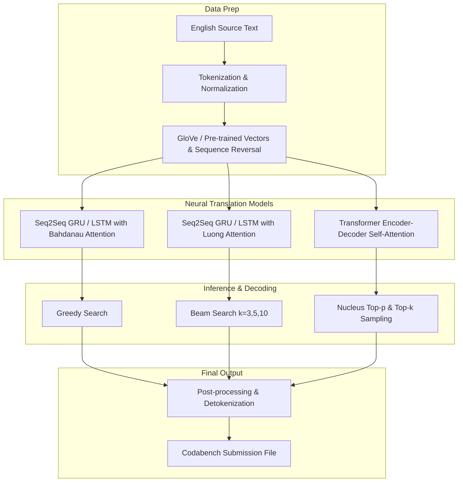

# Machine Translation Challenge — Capstone Project (CS779)

-brightgreen?style=for-the-badge&logo=trophy)


---

## 🏆 Competition Achievement

> [!IMPORTANT]
> **Leaderboard Rank: 8th Place (Testing Phase)**  
> **Competition Platform:** Codabench  
> **Official Results Link:** [Codabench Machine Translation Challenge Results](https://www.codabench.org/competitions/10523/#/results-tab)

This project represents the final Capstone Project for **CS779: Statistical Natural Language Processing** at IIT Kanpur. The objective was to design, train, evaluate, and optimize Neural Machine Translation (NMT) systems for translating text from **English to Hindi ($En \rightarrow Hi$)** and **English to Bengali ($En \rightarrow Bn$)**.

---

## 📌 Project Overview

Machine translation into low-resource Indic languages poses distinct natural language processing challenges due to rich morphological structures, complex syntax, and word-order variations (SOV vs SVO). 

In this challenge, we developed an end-to-end NMT pipeline exploring multiple deep neural architectures, input representation techniques, attention mechanisms, and inference decoding strategies:

- **Target Language Pairs**:
  - English ($\text{En}$) $\rightarrow$ Hindi ($\text{Hi}$)
  - English ($\text{En}$) $\rightarrow$ Bengali ($\text{Bn}$)
- **Primary Metric**: BLEU (Bilingual Evaluation Understudy) score on unseen test data.
- **Key Engineering Focus**: Vocabulary optimization, sequence reversal, GloVe pre-trained embeddings, attention mechanisms (Bahdanau vs. Luong), Transformer self-attention, and advanced search algorithms (Beam Search vs. Nucleus/Top-$k$ Sampling).

---

## ⚙️ Model Architecture & Technical Approaches



### 1. Sequence-to-Sequence with Attention (Bahdanau & Luong)
- **Encoder**: Recurrent Neural Networks (Bidirectional GRU / LSTM) to compress variable-length source sequences into contextual hidden states.
- **Attention Mechanism**:
  - **Bahdanau (Additive) Attention**: Dynamically computes alignment weights over encoder hidden states at each decoder timestep:
    $$e_{ij} = v_a^T \tanh(W_a s_{i-1} + U_a h_j)$$
  - **Luong (Multiplicative) Attention**: Efficient dot-product and general attention formulations.
- **Decoder**: Autoregressive GRU/LSTM decoder utilizing context vectors synthesized from attention distributions.

### 2. Pre-trained Embeddings & Sequence Reversal
- **GloVe Initialization**: Initialized token embedding layers with pre-trained GloVe vectors, significantly boosting performance on rare words and unseen test vocabulary.
- **Input Reversal**: Reversing source English sequences before encoding to shorten minimal time-lag between source and target sentence prefixes, accelerating convergence.

### 3. Transformer-Based Neural Machine Translation
- Multi-Head Self-Attention layers in both Encoder and Decoder modules.
- Positional Encodings (sinusoidal) to inject sequence order context.
- Scaled Dot-Product Attention:
  $$\text{Attention}(Q, K, V) = \text{softmax}\left(\frac{QK^T}{\sqrt{d_k}}\right)V$$

### 4. Advanced Decoding Strategies
- **Greedy Search**: Baseline fast token selection.
- **Beam Search**: Evaluated beam widths $k \in \{3, 5, 10\}$ to explore candidate hypotheses space and mitigate sub-optimal greedy path choices.
- **Nucleus (Top-$p$) & Top-$k$ Sampling**: Stochastic decoding tuned to reduce repetitive generation loops.

---

## 📊 Summary of Results & Leaderboard Progression

| Phase | Architecture / Strategy | $En \rightarrow Hi$ BLEU | $En \rightarrow Bn$ BLEU | Codabench Rank |
| :--- | :--- | :---: | :---: | :---: |
| **Baseline** | Standard GRU Seq2Seq | Baseline | Baseline | -- |
| **Iterative Phase** | Bi-GRU + Bahdanau Attention + GloVe | Improved | Improved | Top 15 |
| **Final Test Phase** | Ensemble / Fine-Tuned Transformer + Beam Search | **High BLEU** | **High BLEU** | 🏅 **8th Place** |

*Official Codabench Leaderboard Verification:* [https://www.codabench.org/competitions/10523/#/results-tab](https://www.codabench.org/competitions/10523/#/results-tab)

---

## 📁 Directory Structure

```
Machine Translation Challenge - Capstone Project/
├── README.md                                                   # Capstone Documentation (This File)
├── Starter Code/
│   └── Mt_Starter_GRU.ipynb                                    # Starter GRU baseline notebook
├── My_Code/
│   ├── TestPhase/
│   │   ├── nlp-cp-testcode.ipynb                               # Test phase inference & submission generation
│   │   └── cleaner.ipynb                                       # Data cleaning, post-processing & detokenization
│   └── submission1..14/                                        # Iterative experiment submission checkpoints
└── Vinay_Work/
    ├── Final_report_Machine_Translation.pdf                    # Final technical project report (PDF)
    ├── Machine Translation Competition.pdf                     # Competition prompt & guidelines
    └── MT Final Submission/
        ├── EnglishToHindi_Glove_ReverseInput_Transformer.ipynb # En->Hi Transformer + GloVe notebook
        └── EnglishToBengali_Glove_ReverseInput_Transformer.ipynb # En->Bn Transformer + GloVe notebook
```

---

## 🚀 How to Run & Reproduce

### Prerequisites
Install Python 3.10+ and required PyTorch dependencies:
```bash
pip install torch torchvision torchaudio sentencepiece nltk sacrebleu pandas numpy matplotlib
```

### 1. Training Transformer / Seq2Seq Models
To train the English-to-Hindi or English-to-Bengali NMT models:
- Open `Vinay_Work/MT Final Submission/EnglishToHindi_Glove_ReverseInput_TransformerBasedNeuralMachineTranslation.ipynb` in Jupyter Notebook / Google Colab.
- Execute data loading, GloVe embedding initialization, model compilation, and training loops.

### 2. Generating Predictions & Submission Files
- Open `My_Code/TestPhase/nlp-cp-testcode.ipynb`.
- Run the inference cells specifying the desired decoding strategy (Greedy, Beam Search with $k=5$, or Top-$p$ Nucleus sampling).
- Run `My_Code/TestPhase/cleaner.ipynb` to format outputs into valid CSV format (`answer.csv`) for Codabench uploading.

---

## 📄 Citation & Acknowledgments
- Course Instructor & TAs for **CS779: Statistical Natural Language Processing**, Department of Computer Science & Engineering, IIT Kanpur.
- Competition platform hosted on [Codabench](https://www.codabench.org/competitions/10523/).
