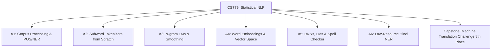

# CS779: Statistical Natural Language Processing — Coursework & Portfolio


---

## 📌 Repository Overview

This repository contains the complete coursework, assignments, and capstone project for **CS779: Statistical Natural Language Processing**, offered by the Department of Computer Science & Engineering at **IIT Kanpur**.

The repository demonstrates foundational and advanced concepts in Statistical NLP, classical language modeling, subword tokenization algorithms from scratch, distributional semantics, deep recurrent neural networks, sequence labeling, and **Neural Machine Translation (NMT)**.

---

## 🌟 Featured Project Spotlight

### 🏆 [Machine Translation Challenge — Capstone Project](./Machine%20Translation%20Challenge%20-%20Capstone%20Project)
- **Achievement**: 🏅 **8th Place in Testing Phase** on [Codabench Competition Leaderboard](https://www.codabench.org/competitions/10523/#/results-tab)
- **Task**: English-to-Hindi ($En \rightarrow Hi$) and English-to-Bengali ($En \rightarrow Bn$) Neural Machine Translation.
- **Architectures & Methods**:
  - Sequence-to-Sequence (Seq2Seq) with Bidirectional GRU/LSTM Encoders & Attention (Bahdanau Additive & Luong Multiplicative Attention).
  - Pre-trained GloVe embedding initialization & input sequence reversal for accelerated convergence.
  - Transformer Encoder-Decoder with Multi-Head Self-Attention.
  - Decoding Algorithms: Empirical evaluation of Greedy Search, Beam Search ($k=3, 5, 10$), Top-$k$ Sampling, and Nucleus (Top-$p$) Sampling.
- 🔗 **Detailed Project Report & Code Walkthrough**: [Read Capstone README](./Machine%20Translation%20Challenge%20-%20Capstone%20Project/README.md)

---

## 📚 Coursework & Assignment Index



### 🔹 [Assignment 1: Corpus Processing & Statistical NLP Fundamentals](./Assignment-1)
- **Topics**: Wikipedia text parsing, tokenization, Document-Frequency matrices, POS Tagging, Named Entity Recognition (NER), TF-IDF categorization, and cosine similarity vector experiments.
- **Key Files**: [`Guna's_CS779_Assignment_1_Questions.ipynb`](./Assignment-1/Guna's_CS779_Assignment_1_Questions.ipynb)

### 🔹 [Assignment 2: Subword Tokenization Algorithms from Scratch](./Assignment-2)
- **Topics**: Implementation of subword tokenization algorithms from scratch without external libraries:
  - **Byte-Pair Encoding (BPE)**: Frequency-based pair merging (`251140009_assignment2_bpe.py`).
  - **WordPiece**: Likelihood-based merge scoring (`251140009_assignment2_wp.py`).
  - **Unigram Language Model Tokenizer**: Viterbi search & EM subword pruning (`251140009_assignment2_unigram.py`).
  - **SentencePiece**: Unigram/BPE tokenization over raw text streams (`251140009_assignment2_sp.py`).
- **Key Files**: [`251140009_assignment2_notebook.ipynb`](./Assignment-2/251140009_assignment2_notebook.ipynb) | [`readme.md`](./Assignment-2/readme.md)

### 🔹 [Assignment 3: N-gram Language Modeling & Smoothing](./Assignment-3)
- **Topics**: Building $N$-gram Language Models ($N=2, 3, 5$), probability estimation, text generation, and advanced smoothing strategies:
  - Add-$k$ (Laplace) Smoothing
  - Good-Turing Frequency Estimation
  - Absolute Discounting & Kneser-Ney Interpolated Smoothing
  - Perplexity evaluation across unseen corpora.
- **Key Files**: [`CS779-A3-Guna-Venkat-Doddi-251140009.ipynb`](./Assignment-3/CS779-A3-Guna-Venkat-Doddi-251140009.ipynb)

### 🔹 [Assignment 4: Word Embeddings & Distributional Semantics](./Assignment-4)
- **Topics**: Word2Vec (CBOW & Skip-Gram) neural architectures, GloVe vector space alignment, word analogy solvers ($A : B :: C : D$), semantic similarity evaluation, and word vector visualizations.
- **Key Files**: [`CS779-A4-Guna-Venkat-Doddi-251140009.ipynb`](./Assignment-4/CS779-A4-Guna-Venkat-Doddi-251140009.ipynb)

### 🔹 [Assignment 5: Recurrent Neural Networks, Language Models & Neural Spell Checker](./Assignment-5)
- **Topics**: Deep RNNs, LSTMs, and GRUs in PyTorch:
  - Character-level Language Models for autoregressive text synthesis.
  - Deep Sentiment Classification on IMDB movie reviews.
  - Neural Contextual Spell Checker fine-tuned with synthetic character noise injection.
- **Key Files**: [`CS779_Assignment_5_Questions.ipynb`](./Assignment-5/CS779_Assignment_5_Questions.ipynb) | [`notebook797febf17d_final.ipynb`](./Assignment-5/notebook797febf17d_final.ipynb)

### 🔹 [Assignment 6: Low-Resource Named Entity Recognition (Hindi NER)](./Assignment-6)
- **Topics**: Sequence labeling for low-resource Indic languages (Hindi). Conditional Random Fields (CRF), BiLSTM-CRF, and fine-tuning transformer token classification models for Hindi NER.
- **Key Files**: [`CS779-A6-Guna-Venkat-Doddi-251140009.ipynb`](./Assignment-6/CS779-A6-Guna-Venkat-Doddi-251140009.ipynb)

---

## 💼 Resume Snippets & Highlights

You can copy and adapt the following pre-formatted bullet points for your resume:

### 📄 Bullet Points for Resume (LaTeX Format)
```latex
\item \textbf{Neural Machine Translation Challenge (CS779 Capstone)} \hfill \href{https://www.codabench.org/competitions/10523/#/results-tab}{\faExternalLink*}
\begin{itemize}
    \item Secured \textbf{8th Place} out of competitive participants on Codabench for English-to-Hindi and English-to-Bengali NMT.
    \item Designed Seq2Seq architectures with Bahdanau/Luong Attention, GloVe embeddings, and Transformer self-attention.
    \item Evaluated inference decoding algorithms (Greedy, Beam Search $k=5$, Top-$p$ Nucleus Sampling) optimizing test BLEU scores.
\end{itemize}

\item \textbf{Statistical NLP Coursework Portfolio (IIT Kanpur)}
\begin{itemize}
    \item Implemented subword tokenization algorithms from scratch (BPE, WordPiece, Unigram LM, SentencePiece) in Python.
    \item Developed N-gram LMs with Kneser-Ney & Good-Turing smoothing, PyTorch LSTM Language Models, and low-resource Hindi NER taggers.
\end{itemize}
```

### 📄 Bullet Points for Resume (Markdown / Plain Text Format)
- **Neural Machine Translation Challenge (Codabench — 8th Place)** | *PyTorch, Transformers, Seq2Seq, Attention, GloVe*
  - Achieved **8th Place** on the Codabench leaderboard in English-to-Hindi and English-to-Bengali NMT tasks.
  - Implemented Seq2Seq Bi-GRU/LSTM networks with Bahdanau/Luong attention and multi-head Transformer architectures.
  - Evaluated decoding strategies (Beam Search, Nucleus Top-$p$ Sampling) to maximize BLEU translation metrics.
- **Statistical NLP & Subword Tokenizers from Scratch** | *Python, NLTK, PyTorch, Scikit-learn*
  - Built BPE, WordPiece, Unigram LM, and SentencePiece tokenization algorithms from scratch without external libraries.
  - Implemented Kneser-Ney smoothing, Word2Vec/GloVe semantic spaces, character LMs, and Hindi NER taggers.

---

## 🛠️ Repository Setup & Usage

```bash
# 1. Clone the repository
git clone https://github.com/Guna-Venkat/CS779_Statistical_NLP.git
cd CS779_Statistical_NLP

# 2. Create a Python virtual environment
python -m venv nlp_env
source nlp_env/bin/activate  # On Windows: nlp_env\Scripts\activate

# 3. Install core dependencies
pip install torch torchvision torchaudio nltk sacrebleu scikit-learn pandas numpy matplotlib jupyter
```

---

## 📄 License & Course Attribution
- Coursework conducted under **CS779: Statistical Natural Language Processing**, IIT Kanpur.
- Author: **Guna Venkat Doddi** (Roll No: 251140009)
